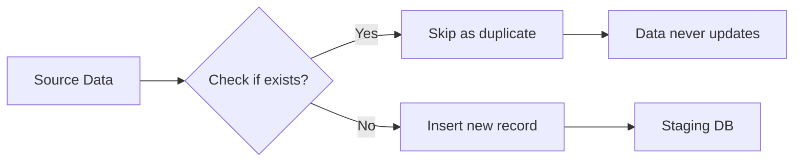
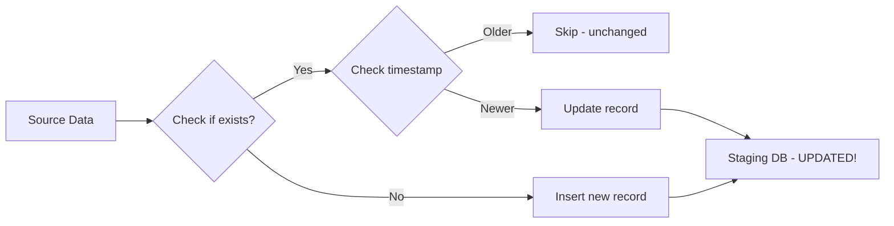

# 📚 **Complete ETL System Explanation**

---

## 🏗️ **System Architecture**

```
┌─────────────────┐     ┌─────────────────┐     ┌─────────────────┐
│   Source DB     │────▶│    ETL Service  │────▶│  Staging DB     │
│  (All_Dataset)  │     │  (Your API)     │     │ (EswatiniHealth)│
└─────────────────┘     └─────────────────┘     └─────────────────┘
         │                       │                        │
         ▼                       ▼                        ▼
  ┌──────────────┐        ┌──────────────┐         ┌──────────────┐
  │LineListings- │        │  HTSETL-     │         │Indicator-    │
  │Prep          │        │  Service     │         │Values_       │
  │aPrepDetail   │─────▶  │  PrEPETL-    │─────▶   │Prevention    │
  │tmpHTS-       │        │  Service     │         │              │
  │TestedDetail  │        │  ARTETL-     │         │Indicator-    │
  │tmpART-       │        │  Service     │         │Values_HIV    │
  │TXOutcomes    │        └──────────────┘         └──────────────┘
  └──────────────┘
```

---

## 🔄 **The ETL Process - Step by Step**

### **Step 1: Triggering the ETL**

There are **3 ways** to trigger an ETL:

#### **A. Manual Trigger (for testing/on-demand)**
```bash
curl -X POST "http://localhost:5171/api/etl/trigger?source=hts" \
  -H "X-ETL-Key: simple-etl-key-2026"
```

#### **B. Scheduled Trigger (automatic midnight runs)**
```csharp
// ScheduledETLService.cs runs at 00:00 every day
var sources = new[] { "hts", "prep", "art" };
foreach (var source in sources) {
    await etlService.RunETLForSourceAsync(source, "scheduler");
}
```

#### **C. Programmatic Trigger (from other parts of your code)**
```csharp
var result = await _etlService.RunETLForSourceAsync("hts", "system");
```

---

### **Step 2: Authentication & Routing**

When the ETL endpoint is called:

```csharp
// ETLEndpoints.cs
public static async Task<IResult> TriggerETL(
    [FromServices] IETLService etlService,
    [FromQuery] string source)
{
    // 1. Check API key (X-ETL-Key header)
    var triggeredBy = context.Request.Headers["X-ETL-Key"];
    
    // 2. Route to correct ETL service
    var result = await etlService.RunETLForSourceAsync(source, triggeredBy);
    
    // 3. Return result
    return Results.Ok(new { success = true, data = result });
}
```

```csharp
// ETLService.cs (the router)
public async Task<ETLResult> RunETLForSourceAsync(string source, string triggeredBy)
{
    return source.ToLower() switch
    {
        "hts" => await _htsETL.RunAsync(triggeredBy),   // HIV Testing
        "prep" => await _prepETL.RunAsync(triggeredBy), // PrEP data
        "art" => await _artETL.RunAsync(triggeredBy),   // ART treatment
        _ => throw new ArgumentException($"Unknown source: {source}")
    };
}
```

---

### **Step 3: Loading Existing Records (The "Memory" Step)**

Before processing new data, each ETL loads **ALL existing records** from the staging database:

```csharp
// From HTSETLService.cs
var existingRecords = await ETLHelper.LoadAllExistingRecordsAsync<IndicatorValuePrevention>(_db, _logger);
```

This creates a **dictionary** in memory with:
- **Key**: A unique string identifying each record
- **Value**: The record's ID and last update time

```csharp
// How the unique key is created
public static string CreateUniqueKey(string indicator, int regionId, DateTime visitDate, 
                                    string ageGroup, string sex, string? populationType = null)
{
    return $"{indicator}|{regionId}|{visitDate:yyyy-MM-dd}|{ageGroup}|{sex}|{populationType ?? "NULL"}";
}

// Example key:
// "HTS_TST|1|2024-06-13|25-29|F|General Population"
```

This dictionary allows the ETL to **instantly check** if a record already exists without querying the database millions of times.

---

### **Step 4: Connecting to Source Database**

Each ETL opens a connection to the source database:

```csharp
// From appsettings.json
"SourceConnection": "Server=10.216.0.10,1480\\SQL2025;Database=All_Dataset;..."

// In ETL service constructor
_sourceConnectionString = configuration.GetConnectionString("SourceConnection");
```

---

### **Step 5: Extracting Data (The "E")**

Each ETL runs a specific SQL query to get its data:

#### **HTS ETL - HIV Testing Data**
```sql
SELECT 
    FacilityCode, VisitDate, AgeGroup, SexName, PopulationGroup,
    HTS_TestedForHIV, HTS_TestedNegative, HTS_TestedPositive,
    HTS_TestedPositiveInitiatedOnART
FROM [All_Dataset].[dbo].[tmpHTSTestedDetail]
WHERE VisitDate IS NOT NULL
ORDER BY VisitDate
```

#### **PrEP ETL - Prevention Data (TWO sources)**
```sql
-- Primary source: LineListingsPrep
SELECT FacilityCode, VisitDate, AgeGroup, SexName, PopulationType,
       PrEP_Initiation, PrEP_TestedForHIV, PrEP_TestedNegative,
       PrEP_TestedPositive, PrEP_InitiatedOnART, CurrentPrepMethod
FROM [All_Dataset].[dbo].[LineListingsPrep]

-- Secondary source: aPrepDetail (for seroconversions)
SELECT FacilityCode, VisitDate, AgeGroup, Sex, PopulationType,
       Seroconverted, InitiatedOnART
FROM [All_Dataset].[dbo].[aPrepDetail]
```

#### **ART ETL - Treatment Data**
```sql
SELECT FacilityCode, ReportingPeriod, AgeGroup, SexName,
       TX_CURR, TX_VLTested, TX_VLSuppressed, TX_VLUndetectable
FROM [All_Dataset].[dbo].[tmpARTTXOutcomes]
WHERE ReportingPeriod IS NOT NULL
```

---

### **Step 6: Transforming Data (The "T") - THE MOST IMPORTANT STEP**

For **each row** read from the source, the ETL does multiple transformations:

#### **A. Region Mapping (Critical for data accuracy)**
```csharp
// From aPrepDetail table, we get facility-region mapping
Facility "H001" → Region "Hhohho" → RegionId = 1
Facility "M020" → Region "Manzini" → RegionId = 2
Facility "S095" → Region "Shiselweni" → RegionId = 3
Facility "L066" → Region "Lubombo" → RegionId = 4
```

#### **B. Sex Standardization**
```csharp
var sex = sexName.ToUpper() switch
{
    "MALE" => "M",
    "FEMALE" => "F",
    _ => "Other"  // Handles any unexpected values
};
```

#### **C. Creating Multiple Indicator Records from One Source Row**

**Example: A single HTS test row creates up to 4 records:**

| Source Column | Value | Creates Indicator |
|--------------|-------|-------------------|
| HTS_TestedForHIV | 1 | `HTS_TST` |
| HTS_TestedNegative | 1 | `HTS_NEG` |
| HTS_TestedPositive | 0 | (nothing) |
| HTS_TestedPositiveInitiatedOnART | 0 | (nothing) |

**Result: 2 new records** (tested + negative result)

#### **D. Handling Different Data Types**
```csharp
// aPrepDetail stores booleans as strings
var seroconverted = reader.GetString(5).Trim().ToLower();
if (seroconverted == "1" || seroconverted == "true" || seroconverted == "yes")
{
    // Create seroconversion record
}

// Sex is stored as tinyint (byte)
int? sexValue = reader.GetByte(3);
var sex = sexValue switch { 1 => "M", 2 => "F", _ => "Other" };
```

---

### **Step 7: The NEW Deduplication & Update Logic (Critical Change)**

This is the **most important improvement** in your latest ETL:

```csharp
public static async Task<(int Inserted, int Updated, int Skipped)> ProcessRecordsAsync<T>(
    List<T> records, StagingDbContext db, ILogger logger, string batchId,
    Dictionary<string, (DateTime UpdatedAt, int Id)> existingRecords)
{
    var newRecords = new List<T>();
    var recordsToUpdate = new List<(T Record, int Id)>();
    var skippedRecords = 0;

    foreach (var record in records)
    {
        var key = CreateUniqueKey(...);

        if (existingRecords.TryGetValue(key, out var existing))
        {
            // KEY CHANGE: Check if this is NEWER data
            if (record.UpdatedAt > existing.UpdatedAt)
            {
                // This record has been updated in the source!
                recordsToUpdate.Add((record, existing.Id));
                existingRecords[key] = (record.UpdatedAt, existing.Id);
            }
            else
            {
                // Same data, skip it
                skippedRecords++;
            }
        }
        else
        {
            // Brand new record
            newRecords.Add(record);
        }
    }

    // Insert new records
    if (newRecords.Any())
    {
        await db.AddRangeAsync(newRecords);
        inserted = await db.SaveChangesAsync();
    }

    // UPDATE existing records that changed
    foreach (var (record, id) in recordsToUpdate)
    {
        var existing = await db.Set<T>().FindAsync(id);
        if (existing != null)
        {
            existing.Value = record.Value;
            existing.UpdatedAt = record.UpdatedAt;
            existing.PopulationType = record.PopulationType;
            updated++;
        }
    }
    
    if (updated > 0) await db.SaveChangesAsync();

    return (inserted, updated, skippedRecords);
}
```

**What this means for your data:**

| Scenario | Before | After |
|----------|--------|-------|
| **Patient visit from 2 months ago** | ❌ Ignored (duplicate) | ✅ Checked if data changed |
| **Test result corrected from negative to positive** | ❌ Never updated | ✅ Updated in staging |
| **New data added for old date** | ❌ Skipped | ✅ Inserted as new |
| **Patient's age group corrected** | ❌ Never fixed | ✅ Updated automatically |

---

### **Step 8: Batch Processing for Performance**

Instead of saving one record at a time (slow), records are collected in batches:

```csharp
if (allRecords.Count >= _batchSize)  // Default: 10,000 records
{
    var (ins, upd, skp) = await ETLHelper.ProcessRecordsAsync(
        allRecords, _db, _logger, batchId, existingRecords);
    allRecords.Clear();
}
```

This is **~100x faster** than individual inserts!

---

### **Step 9: Progress Reporting**

Every 10,000 records, you see progress:

```
[16:20:29 INF] Processed 10,000 aPrepDetail records
[16:20:30 INF] Processed 20,000 aPrepDetail records
[16:20:30 INF] Processed 30,000 aPrepDetail records
```

---

### **Step 10: Final Summary**

After processing, you get a beautiful box showing exactly what happened:

```
╔══════════════════════════════════════════════════════════╗
║                    HTS ETL SUMMARY                       ║
╠══════════════════════════════════════════════════════════╣
║  Records Read:          94,968                              ║
║  Records Inserted:         355                              ║
║  Records Updated:           12                              ║
║  Records Unchanged:     94,601                              ║
║  Time Elapsed:          4,064ms                              ║
╚══════════════════════════════════════════════════════════╝
```

---

## 📊 **What Each ETL Does in Detail**

### **HTS ETL (HIV Testing)**
```
Source: tmpHTSTestedDetail (94,968 rows)
Target: IndicatorValues_Prevention

One patient visit can create:
- HTS_TST (tested for HIV)
- HTS_NEG (tested negative)
- HTS_POS (tested positive)
- LINKAGE_ART (started ART after positive)

Total possible records from one visit: Up to 4
```

### **PrEP ETL (Prevention)**
```
Primary Source: LineListingsPrep (4,760 rows)
Secondary Source: aPrepDetail (198,835 rows)
Target: IndicatorValues_Prevention

Indicators created:
- PREP_NEW (started PrEP)
- PREP_TESTED (tested for HIV while on PrEP)
- PREP_NEG (tested negative)
- PREP_POS (tested positive - seroconversion)
- PREP_SEROCONVERSION (separate indicator for seroconversion)
- PREP_LINKAGE_ART (started ART)

The ETL combines BOTH sources, using the unique key to prevent duplicates
```

### **ART ETL (Treatment)**
```
Source: tmpARTTXOutcomes (334,385 rows)
Target: IndicatorValues_HIV

Indicators created (quarterly data):
- TX_CURR (currently on ART)
- TX_VL_TESTED (had viral load test)
- TX_VL_SUPPRESSED (viral load suppressed)
- TX_VL_UNDETECTABLE (viral load undetectable)
```

---

## 🔍 **How the Latest Change Affects Your Data**

### **Before (Old ETL)**


**Problem**: If a record from 2 months ago was corrected in the source, your staging DB never knew about it!

### **After (New ETL)**


**Now**: Every record is checked for updates, regardless of age!

---

## 📈 **Example: A Patient's Journey Through the ETL**

Let's follow **Patient 123** through the system:

### **February 15, 2024 - Initial Visit**
```
Source: HTS_TestedForHIV = 1, HTS_TestedNegative = 1
ETL creates: HTS_TST, HTS_NEG
Staging DB now has 2 records
```

### **February 20, 2024 - Data Correction**
```
Nurse realizes: Patient actually tested POSITIVE!
Source corrected: HTS_TestedPositive = 1, HTS_TestedNegative = 0

OLD ETL: Would SKIP because Feb 15 records already exist
NEW ETL: 
  1. Sees HTS_NEG record has UpdatedAt = Feb 15
  2. New data has UpdatedAt = Feb 20 (newer!)
  3. Updates HTS_NEG → changes value to 0
  4. Inserts new HTS_POS record with value 1
```

### **Result in Staging DB (Correct!)**
| Indicator | Date | Value | Last Updated |
|-----------|------|-------|--------------|
| HTS_TST | Feb 15 | 1 | Feb 20 |
| HTS_NEG | Feb 15 | **0** | **Feb 20** |
| HTS_POS | Feb 15 | **1** | **Feb 20** |

---

## 🎯 **Key Takeaways**

1. **ETL runs 3 separate jobs** - HTS, PrEP, and ART, each handling different data

2. **All data is processed every time** - No date filters, everything gets checked

3. **Unique keys prevent duplicates** - Each record is identified by indicator + region + date + demographics

4. **Timestamps determine updates** - If source data is newer, staging gets updated

5. **Batch processing = fast** - 10,000 records at a time

6. **Progress logging keeps you informed** - You see what's happening in real-time

7. **Beautiful summaries show results** - Inserted vs Updated vs Skipped counts

8. **Scheduled runs at midnight** - Your data is always fresh when you arrive in the morning

---

## 🚀 **What This Means for You**

| Question | Answer |
|----------|--------|
| **Will corrections from 2 months ago be reflected?** | ✅ YES - if source timestamp is newer |
| **Will I see how many records were updated?** | ✅ YES - in the summary boxes |
| **How long does it take?** | ~30 seconds to 5 minutes depending on data volume |
| **When does it run?** | Every night at midnight |
| **Can I run it manually?** | ✅ YES - using curl commands |
| **Will it slow down my database?** | ✅ NO - batch processing and 30-second delays between jobs |

ETL system is now **self-healing** - it automatically corrects any data changes, no matter when they were made! 🎯
